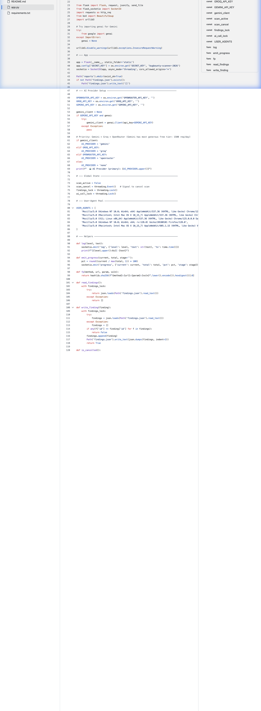
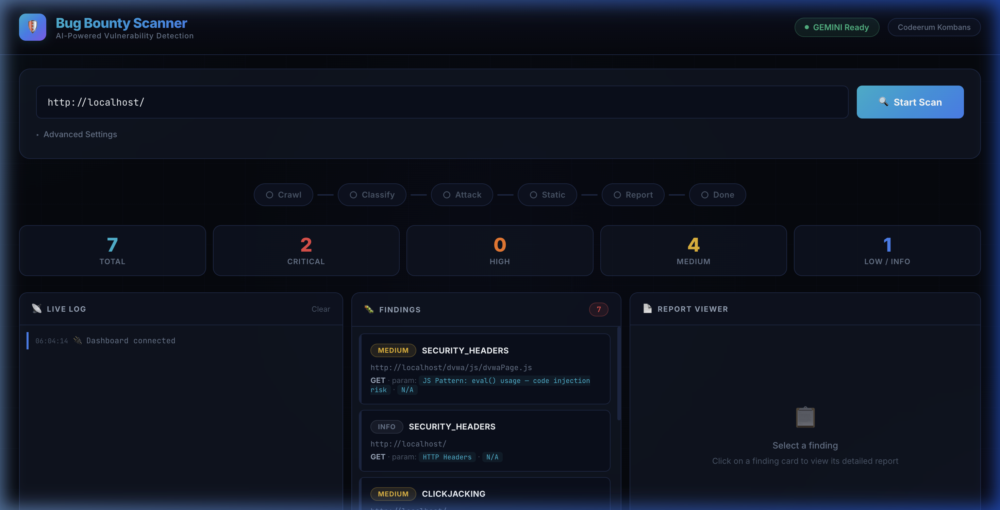
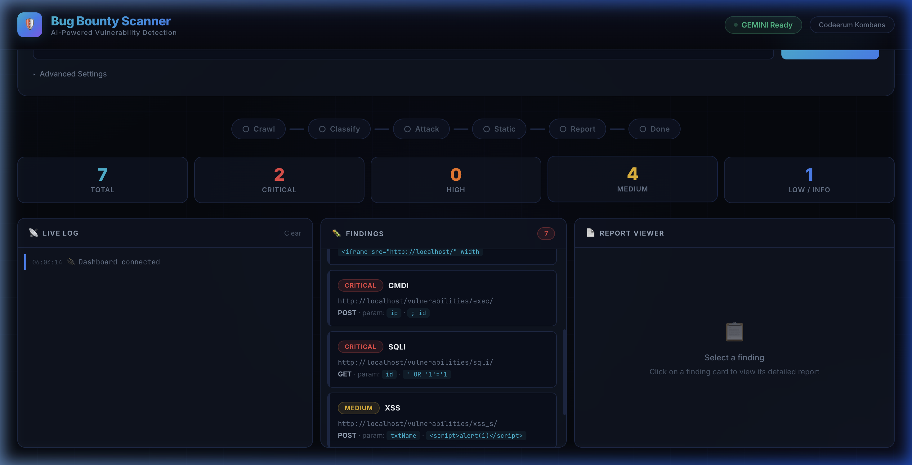

# AI-Powered Bug Bounty Scanner

## Problem Statement
Security testing is manual, slow, and expensive. Traditional automated scanners are pattern-matching tools that throw massive wordlists at websites without understanding context. They produce overwhelming false positives and miss nuanced vulnerabilities that require contextual reasoning. There is a critical need for an intelligent, automated vulnerability scanner that can **think like a hacker** — understanding endpoint context, generating targeted payloads, and confirming real exploits with zero manual effort.

## Project Description
An automated, AI-driven web application vulnerability scanner that crawls a target website, uses **Google Gemini AI** to classify potential vulnerabilities per endpoint, generates smart attack payloads, tests them, and uses AI again to analyze responses and confirm real vulnerabilities — all streamed live to a real-time dashboard.

**How it works — 5 automated stages:**
1. **Fingerprint** — Detects server tech stack, programming language, framework, and WAF presence
2. **Crawl** — Discovers all endpoints, forms, query parameters, robots.txt & sitemap.xml paths
3. **Classify (AI)** — Sends endpoint metadata to Gemini to predict vulnerability types based on parameter names, HTTP methods, and URL context
4. **Attack & Verify** — AI generates targeted payloads (e.g., `' OR '1'='1` for `id` param), sends baseline + attack requests, AI analyzes response differential to confirm exploitation
5. **Report** — Generates professional Markdown bug bounty reports with severity, evidence, reproduction steps, and remediation

**What makes it useful:**
- Detects **9+ vulnerability types**: SQLi, XSS, CMDi, LFI, SSRF, IDOR, CSRF, File Upload, Open Redirect
- **Zero false positives** — AI confirms every finding by analyzing actual response differences
- **DVWA auto-detection** — Auto-logins, sets security level, disables PHPIDS
- **WAF bypass** — URL double-encoding, SQL comment bypass, case variation
- **Multi-AI fallback** — Gemini → Groq → OpenRouter with automatic retry on rate limits
- **Real-time dashboard** — Watch the scanner hack in real-time via WebSocket

---

## Google AI Usage
### Tools / Models Used
- **Google Gemini 2.0 Flash** (`gemini-2.0-flash`) via `google-genai` Python SDK

### How Google AI Was Used
Google Gemini AI is the **core brain** of the scanner, integrated at three critical pipeline stages:

1. **Vulnerability Classification (Stage 2):** The list of discovered endpoints is sent to Gemini with context (parameter names, HTTP methods, URL paths). Gemini predicts which vulnerability type each endpoint is likely susceptible to (SQLi, XSS, CMDi, etc.) based on contextual reasoning — not just pattern matching.

2. **Smart Payload Generation (Stage 3a):** For each classified endpoint, Gemini generates 3-5 **targeted attack payloads** specific to the vulnerability type and parameter context. For example, a parameter named `ip` on a page called `/exec/` gets command injection payloads like `; cat /etc/passwd` instead of generic SQLi payloads.

3. **Response Analysis & Confirmation (Stage 3b):** After sending both a baseline request and an attack request, both responses are sent to Gemini. It acts as a security analyst — comparing the two responses to confirm whether the vulnerability was actually exploited (e.g., "all database rows were returned instead of one" → confirmed SQLi).

4. **Report Generation (Stage 4):** Gemini generates professional, submission-ready bug bounty reports with steps to reproduce, impact assessment, and remediation advice.

---

## Proof of Google AI Usage

**Code Integration — Gemini SDK initialization and AI provider setup:**



**Dashboard showing "GEMINI Ready" badge — confirming active Gemini AI connection:**



---

## Screenshots
**Dashboard — Main view with scan input, stage pipeline, stats, and 3-panel layout:**

  

**Findings Panel — Real-time vulnerability discovery (Critical CMDi, SQLi, Medium XSS):**



---

## Demo Video
Upload your demo video to Google Drive and paste the shareable link here (max 3 minutes).
[Watch Demo](#)

---

## Installation Steps

```bash
# Clone the repository
git clone https://github.com/vldevadath/build-with-ai-chn-kombans.git

# Go to project folder
cd build-with-ai-chn-kombans

# Install dependencies
pip install -r requirements.txt

# Configure API keys
cp .env.example .env
# Edit .env with your Gemini API key:
# GEMINI_API_KEY=your_gemini_api_key_here

# Run the project
python app.py
```

Open **http://127.0.0.1:7331** in your browser.

### Testing with DVWA (Recommended)

```bash
# Start DVWA in Docker
docker run -d -p 80:80 --name dvwa vulnerables/web-dvwa

# In the scanner, enter: http://127.0.0.1/
# The scanner auto-detects DVWA, logs in, and begins scanning
```

---

## Team
**Team Kombans** — Codeerum | Build with AI CHN Hackathon 2026
